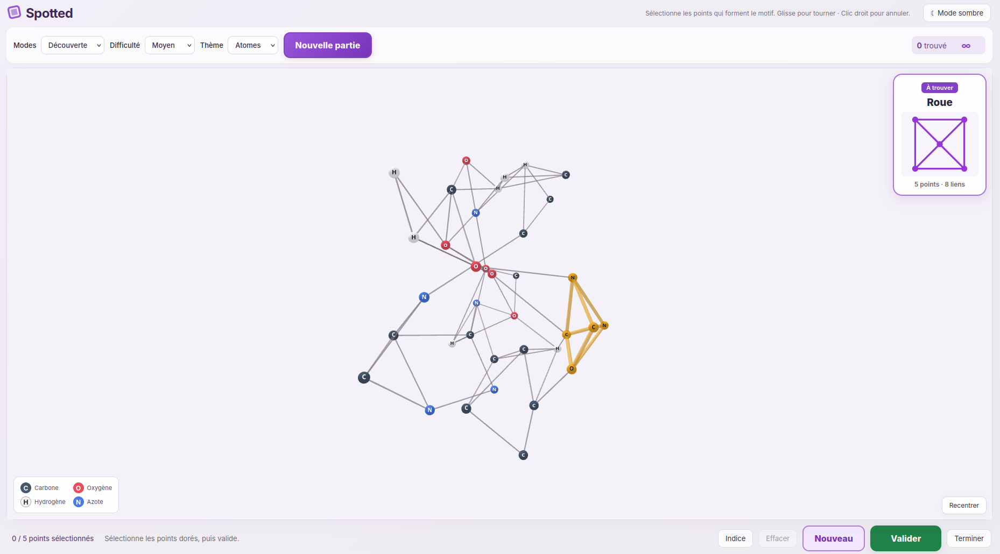
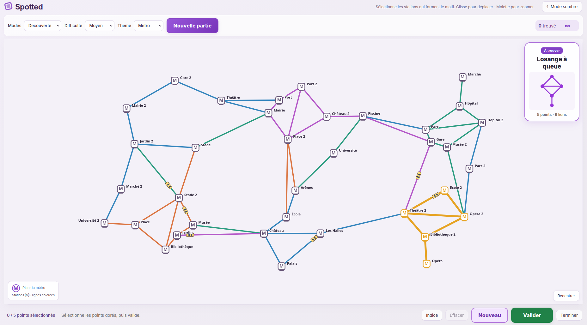

# Spotted

Spotted est un jeu de repérage de motifs dans des graphes, conçu pour la Fête de la science. L'objectif est de retrouver une forme parmi des atomes en 3D ou sur un plan de métro en 2D, en sélectionnant les points qui ont exactement les mêmes liens que le modèle.

Avec Python 3.12 ou une version supérieure, exécutez les commandes suivantes depuis la racine du projet pour créer un environnement virtuel, installer les dépendances et lancer le jeu :

```sh
python3 -m venv .venv
source .venv/bin/activate
python -m pip install -r requirements.txt
cp eel/__init__.py "$(python -c 'import sysconfig; print(sysconfig.get_path("purelib"))')/eel/__init__.py"
cd project
python run.py --config config/launch.toml
```

La commande `cp` remplace le fichier Eel installé dans l'environnement virtuel par la version fournie avec le projet, afin d'éviter l'erreur `TypeError: start() got an unexpected keyword argument 'open_browser'`.

Le lancement du jeu ouvre la page [http://localhost:7000](http://localhost:7000) dans Firefox. Le terminal doit rester ouvert pendant le jeu ; `Ctrl+C` arrête le serveur.

Pour jouer, il suffit de choisir un niveau, de préférence **Facile** pour commencer, de faire glisser la scène pour l’explorer, de zoomer avec la molette et de cliquer sur les points du motif. Le mode **Découverte** montre la solution en doré pour apprendre ; le mode **Libre** permet de chercher à son rythme, avec des indices si besoin. Dans ces deux modes, il faut cliquer sur **Valider**, puis sur **Suivant** après une réussite. En mode **Chrono**, il faut cliquer sur **Démarrer**, puis trouver un maximum de motifs avant la fin du temps imparti : la validation et le passage au motif suivant sont automatiques.

## Aperçus

[](./docs/game_atomes.png)
[](./docs/game_train.png)
